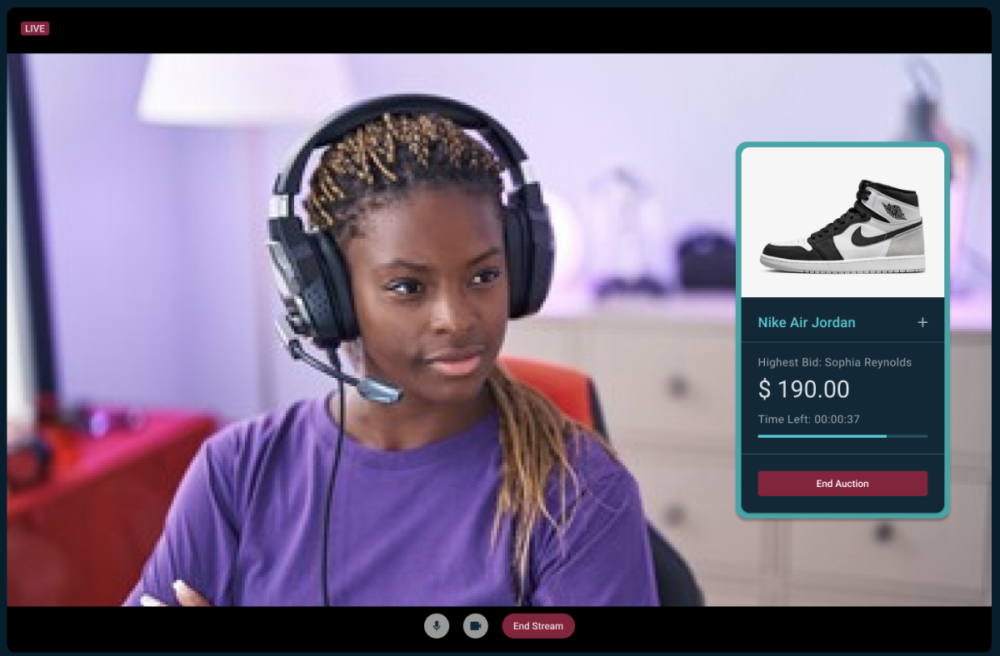
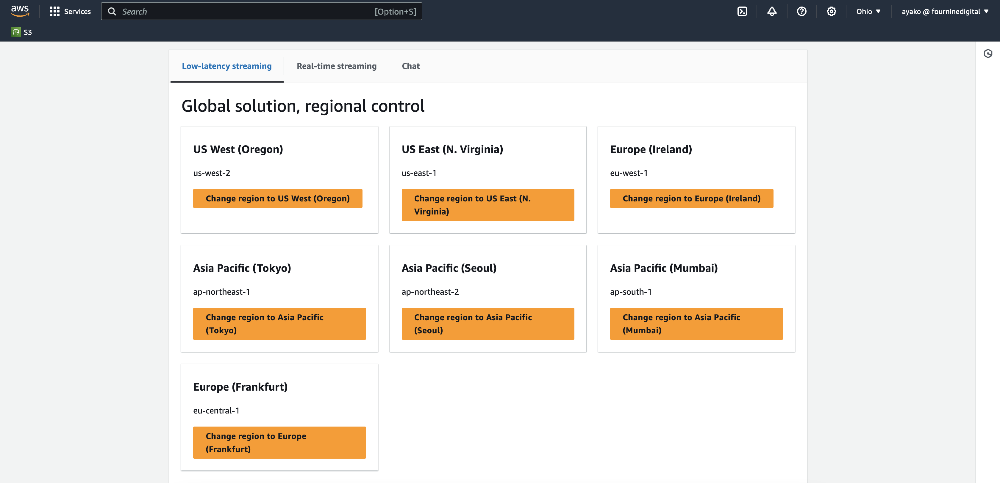
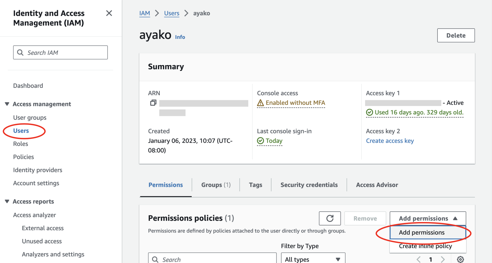
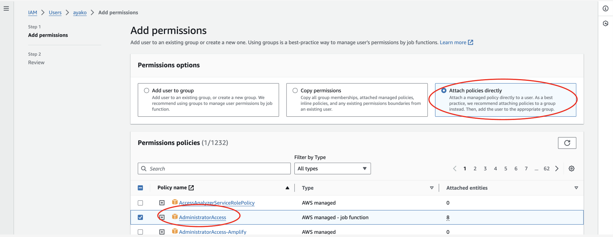
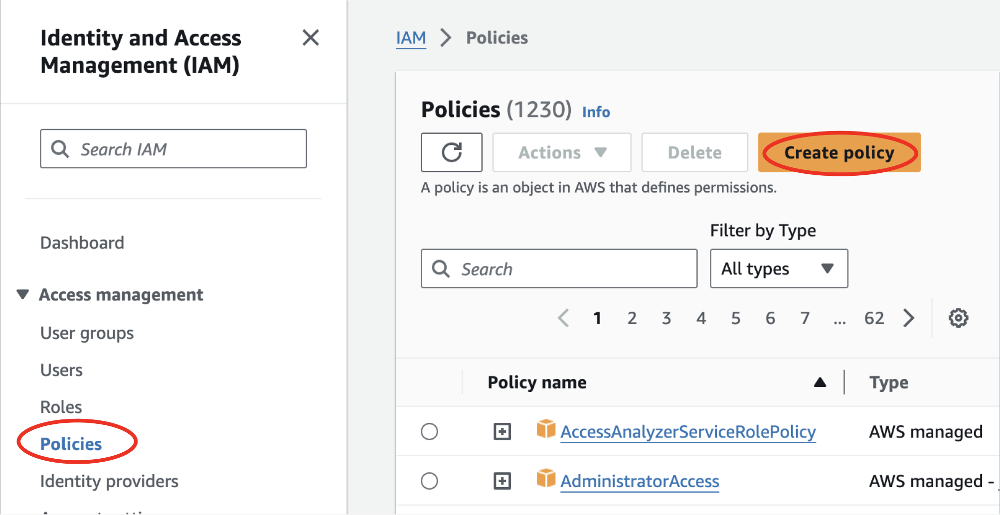
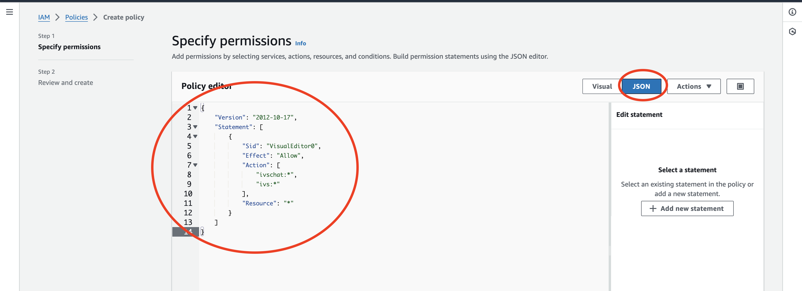

# Simple Real-Time Auction Bidding App with AWS Interactive Video Service (IVS) Chat and ReactJS

<br />

This is a [Next.js](https://nextjs.org/) project bootstrapped with [`create-next-app`](https://github.com/vercel/next.js/tree/canary/packages/create-next-app).

For further reading about the project, visit our medium blog post at
[https://medium.com/p/xxxxxxxxxx](https://medium.com/p/8e6ebe211081/edit)


##  Get the project up and running

To launch the completed project, follow these steps:

- [Step 1. Get Permissions Policy](#1-get-permissions-policy)
- [Step 2. Make a new IVS channel](2-make-a-new-ivs-channel)
- [Step 3. Copy the IVS Channel Keys and store them in env file](#3-copy-the-ivs-channel-keys-and-store-them-in-env-file)
- [Step 4. Make a IVS chat room](#4-make-a-ivs-chat-room)
- [Step 6. Test the project](#5-test-the-project)

<br />

### Prerequisites

You would need to log in to your [AWS Console Account](https://aws.amazon.com/console/) to complete this tutorial!
Go to the top of the [IVS(Interactive Video Service)](console.aws.amazon.com/ivs/) page.
Make sure you’re in the right region, because IVS is limited to the regions shown below.

We are going to pick `us-west-2` for this project since we are located in that region.

<br />


## 1. Attach permissions to your account

*What is permissions?*
You need to allow your account/user to use the AWS Services for retrieving & editing data. If you already have access, you can skip this part!

To add policies, you can either: 

- A. attach an AdministratorAccess policy to yourself
- B. attach an IVS and IVS Chat policy to yourself


### A. Attach an AdministratorAccess policy to yourself

Adding AdministratorAccess to an IAM user is the easiest choice because it gives free access to all services in AWS. However, for security reasons, this is not ideal. 
If you were just applying access to yourself just for the sake of testing, this is a fast choice.

- Go to AWS console and navigate to the [IAM services pages](console.aws.amazon.com/iam)
- Click the `Users` tab on the left, and click YOUR username on the list
- Under `Permissions policies`, click `Add Permissions` button in the dropdown.
- Click the third tab `Attach policies directly`
- Find `Administrator Access`` in the list and click the check, then click `Next` button in the bottom
- On the next page, click `Add Permissions`

<br />
<br />

### B. Attach an IVS and IVS Chat policy to yourself

Instead of attaching AdmistratorAccess, you can create new Permission policies by just allowing users to use IVS.

- Go to AWS console and navigate to the IAM services pages
- Click on the `Policies` tab on the left
- Click the button `Create policy`
- Click `JSON` tab so that we can enter permissions via JSON format
- In the Policy editor, copy and paste the following


```test.json
{
	"Version": "2012-10-17",
	"Statement": [
		{
			"Sid": "VisualEditor0",
			"Effect": "Allow",
			"Action": [
				"ivschat:*",
				"ivs:*"
			],
			"Resource": "*"
		}
	]
}

```

<br />
<br />

#### **`.env.local`**


## 2. Make a new IVS channel 

Once you’ve got permissions, we can make a IVS Channel

- Go to the AWS Console and access the Interactive Video Service page
- Select “Channel” tab on the left hand sidebar
- Click the button “Create channel” on the top right corner.
- Enter a channel name, and click the “Create channel” button on the bottom
- Once it's created, click your channel name in the list to go to details page
- From the channel, details page, copy the following keys:

```
ARN
Stream key
Ingest server
Playback URL
```

## 3. Copy the IVS Channel Keys and store them in env file

Download the project:
[https://github.com/Four-Nine-Digital/fnd-ivs-auction-demo-simple](https://github.com/Four-Nine-Digital/fnd-ivs-auction-demo-simple)

Create a new `.env` file, and copy the keys of the channel above in the following constants.

```.env
NEXT_PUBLIC_CHANNEL_ARN=
NEXT_PUBLIC_STREAM_KEY=
NEXT_PUBLIC_INGEST_SERVER=
NEXT_PUBLIC_PLAYBACK_URL=
```

Make sure to also fill in the NEXT_PUBLIC_AWS_REGION=, which is the AWS region which you decided to create the channel.

```.env
NEXT_PUBLIC_AWS_REGION=
```

## 4. Make a IVS chat room

Now that we’ve made a channel, we can create a chat room: now.

- Go to the AWS Console and access the Interactive Video Service page
- Select `Rooms` tab under `Chat` on the left hand sidebar
- Click the button `Create room` on the top right corner.
- Enter a chat room name, and click the `Create room` button on the bottom
- Once it's created, click your chat room name in the list to go to details page
- From the channel, details page, copy the room `ARN`
- In your .env file of the project, add the copied ARN in the key  NEXT_PUBLIC_CHATROOM_ID=

```.env
NEXT_PUBLIC_CHATROOM_ID=your_chat_room_ARN
```

## 5. Test the project


### A. Run project

In your terminal, run

```
npm install
npm run dev
```

### B. Access page

- When the code has successfully started, access `http://localhost:3000`
- Enter a `username` and click on `streamer`
- Open another tab with `http://localhost:3000`, and this time pick `viewer`

Now 2 tabs of a streamer and viewer will be open

### C. Allow permissions

- In the Streamer page, you will be asked for permissions to access the microphone and camera.
- Click “Allow”


### D. Start Stream

- In the Streamer page, click the green button `Go LIVE`
- Wait 5 seconds before `LIVE` label shows up.

- In the Viewers page, the stream show start playing


### Result!

`show result image`

For further reading about the project, visit our medium blog post at
[https://medium.com/p/xxxxxxxxxx](https://medium.com/p/8e6ebe211081/edit)


At [Four Nine Digital](https://fournine.digital/), we are passionate about Technology and Design because we believe that the world can be both efficient and beautiful. By focusing on the user, having time-tested processes, and strong collaboration we build applications and websites that make a difference.

If you would like to learn more about us, visit our website or email us at: [info@fournine.digital](info@fournine.digital)